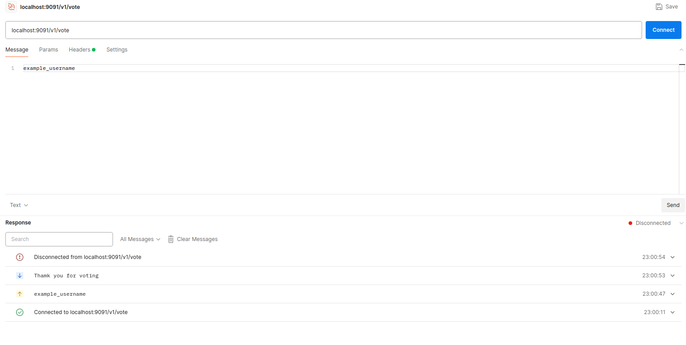
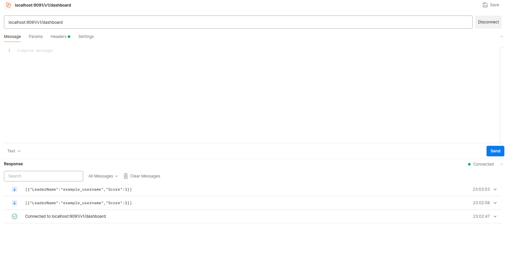

## A Voting system
A simple voting system built with grpc and websockets to vote and get the latest updates, built with gorilla websockets, grpc-gateway and redis.

## Endpoints
- `v1/login` for logging, use header `Content-Type` -> `application/grpc`
 ```json
{
  "username": "example_username",
  "password": "example_password"
}
 ```

- `v1/register` for registering, use header `Content-Type` -> `application/grpc`
```json
{
  "username": "example_username",
  "password": "example_password",
  "isstandingforelection": true
}
```
- `v1/vote` To vote with header `BearerToken` with the JWT token you get from the previous endpoints
- `v1/dashboard` To get the current leaderboard value, use header `BearerToken` with the JWT token you get from the previous endpoints.

## Sample Voting
Attached a Voting and dashboard to get all the data
 
Sample Voting added


Sample Dashboard with all the data

## Project Structure
- `cmd/` contains the main file to be run.
- `proto/` contains the proto and generated files for the grpc server.
- `internal/`contains all the code used to build the app.
The general strucutre of the app is MVC (containing controller/handler - service - Repository). There exists a seperate entities package for the entities that are used to along the project.

## Commands to Run the project

To run the project in localhost
```shell
docker compose up
```

To generate proto files
```shell
protoc -I ./proto \
  --go_out ./proto --go_opt paths=source_relative \
  --go-grpc_out ./proto --go-grpc_opt paths=source_relative \
  --grpc-gateway_out ./proto --grpc-gateway_opt paths=source_relative \
--plugin=protoc-gen-grpc-gateway=${GOPATH}/bin/protoc-gen-grpc-gateway \
  ./proto/user.proto
```